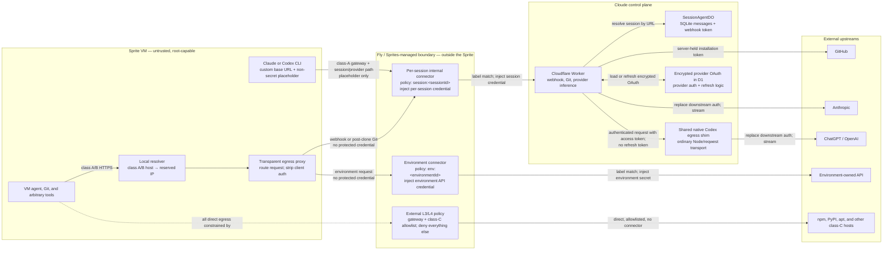
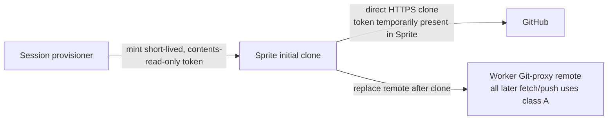
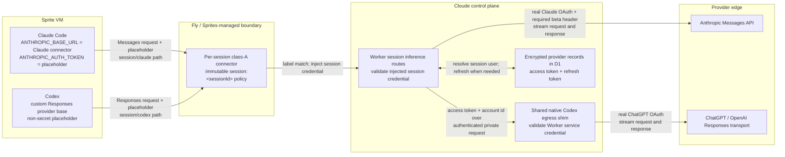

## Context

This designs the **Sprite secrets proxy** as one coherent system. It is a large,
multi-pronged change; the architecture below is whole, and the "Staging" section
sequences the _build_ without splitting the _concept_. Nothing here is meant to be
redesigned later — the abstractions (connector taxonomy, routing table, D1 schema,
data/control planes) are chosen so every prong composes.

### The three prongs (all in scope)

1. **Caller-identity binding.** Every protected credential is authorized by the
   _verified identity of the calling Sprite_, not by possession of a bearer secret.
   Fly checks the connector's access policy against the calling Sprite before
   injecting the credential, so an extracted URL/secret cannot be replayed from a
   laptop, another org's Sprite, or after the session ends.
2. **Protected secrets out of the sandbox.** Webhook, post-clone git, provider, and
   environment credentials never exist inside the Sprite. Fly injects connector
   credentials downstream of the Sprite. Refreshable provider OAuth remains in our
   encrypted D1 record and is injected by the control plane after the per-session
   class-A connector authenticates the Sprite. The initial clone is the explicit
   exception: it uses the existing short-lived, contents-read-only GitHub
   installation token inside the Sprite to avoid putting the bulk clone on the
   connector/proxy path.
3. **Header credentials via connectors + a transparent MITM proxy.** For the first
   version, an environment can define one header-injected credential per upstream
   hostname. A Sprite-local transparent proxy routes the Sprite's _unmodified_
   egress to the matching connector, which injects the real secret. Multiple
   credentials for one hostname and non-header authentication are out of scope.

### Threat model

The session agent runs untrusted code **with root** (passwordless `sudo`, verified).
It can read anything in the Sprite, flush iptables, kill the proxy, read the local
CA key. The design must therefore make security independent of anything the Sprite
controls:

- **Prevented:** off-Sprite replay of webhook, post-clone git, provider, and
  environment credentials (prong 1, via Fly identity checks); extraction of those
  protected secrets (prong 2); exfiltration to arbitrary hosts (network egress
  policy, enforced outside the VM at L3/L4 — verified).
- **Not prevented (accepted, and true of any design):** a _live_ compromised Sprite
  using the connectors it is legitimately authorized for (e.g. spending the user's
  own OpenAI budget during the session); and runtimes that bypass the local CA
  (contained by the network policy, which still blocks their real egress).
- **Explicitly accepted for initial clone:** the root-capable Sprite can observe and
  replay the short-lived contents-read-only installation token while it remains
  valid. That token cannot push, and the Sprite receives the same repository
  contents through the clone. Subsequent fetch and push move to the class-A
  connector; the initial clone is not proxied because the extra hop would add
  material latency to the largest git transfer.

### What already exists (build on it, don't reinvent)

- `network-policy.ts` — `buildFinalNetworkPolicy` with a `locked` mode (Worker +
  provider + `deny-all`). The Sprites network policy is enforced outside the VM at
  **L3/L4** (verified: IP-direct `connect()` to non-allowlisted hosts is refused).
- `GitProxyService` — Sprite calls `WORKER_URL/git-proxy/:sessionId/...` with a
  per-session `gitProxySecret` written into git config as
  `Authorization: Bearer <secret>`; the Worker mints the GitHub installation token
  and injects it only when forwarding to GitHub. Push branch validation
  (`cloude/*` + session suffix + branch lock) and repo allowlist are enforced.
- `session-provision.service.ts` — `cloneRepo`, git remote setup, and a
  `plainEnvVars` path (the very name implies the missing _secret_ env path this
  change provides).

The gap: webhook, post-clone git, and provider calls are authenticated by **bearer
secrets in the Sprite**, which are replayable and extractable. No transparent proxy
exists, and there is no path for environment-owned header credentials.

## The unified model

Classify every outbound flow, and route each class exactly one way:

| Class                             | Examples                             | Path                                                                                                            |
| --------------------------------- | ------------------------------------ | --------------------------------------------------------------------------------------------------------------- |
| A. Credential → our control plane | webhook, git, Claude/Codex inference | Sprite → **internal per-session connector** → Worker; Worker injects or delegates the final upstream credential |
| B. Credential → external upstream | environment header secret            | Sprite → transparent proxy → **environment connector** → upstream (injects the real secret, Sprites-custodied)  |
| C. No credential                  | npm, pypi, github raw, apt, etc.     | network-allowlisted, **direct** egress (no connector)                                                           |
| D. Everything else                | arbitrary hosts                      | **denied** by the network policy                                                                                |

A connector is the single primitive for A and B: **Fly verifies Sprite identity →
injects a connector credential → forwards.** Provider inference is class A because
it enters our control plane under the same session identity as webhook and git.
Provider CLIs use their supported custom gateway configuration when available.
The transparent proxy is the routing layer that makes classes A and B work for
_unmodified_ code (prong 3), and the network policy makes C/D a hard boundary.

### System topology and trust boundaries

The connector boxes below represent the **Fly/Sprites-managed connector service**.
They are not processes inside the Sprite and they are not part of our Worker. Fly
owns the identity check, label-policy enforcement, and final header injection. The
exact connector runtime placement inside Fly's network is platform-managed and
opaque to us.



There are three distinct credential hops:

1. The Sprite sends no protected credential (or a literal placeholder).
2. The connector authenticates the Sprite from platform identity and labels, then
   injects a narrowly scoped credential on the connector-to-control-plane or
   connector-to-upstream hop.
3. For provider inference and Git, the control plane exchanges that internal
   identity for the real upstream credential. The real OAuth or GitHub installation
   token exists only on the final control-plane-to-provider hop.

## Connector taxonomy

Two kinds of connector, differing in lifetime, what they inject, and who custodies
the secret:

### Internal connector (class A) — per session

- **Lifetime:** one per session, minted at provisioning, deleted at teardown.
- **Base URL:** our Worker (`WORKER_URL`), path-routed so one connector serves
  existing `/internal/session/:sessionId/{chunks|events}` and
  `/git-proxy/:sessionId/...`, plus
  `/internal/session/:sessionId/inference/{claude|codex}/...` (the gateway forwards
  `base + <path after conn id>`). Provider CLIs point their supported custom base URL
  directly at the inference prefix; webhook/git can use the transparent proxy.
- **Injected secret:** the existing **per-session control-plane token**, generated and
  stored by the session Durable Object in its SQLite. The Worker route resolves the
  Durable Object from the existing `:sessionId` path, and that Durable Object
  validates the gateway-injected token. There is no generic `/webhook` route or D1
  secret-to-session lookup. The implementation may retain the current
  `webhook_token` storage name initially, but its authority is explicitly broadened
  to the session's allowlisted webhook, git, and inference routes.
- **Scope:** a **per-session label** (e.g. `session:<sessionId>`) set on the Sprite
  before the connector is minted; the connector policy is
  `sprite_labels: [session:<sessionId>]`. The API
  has no Sprite-id scoping field (only `sprite_labels` / `name_prefix`), and in-VM
  root cannot change Fly labels, so a unique per-session label uniquely and immutably
  binds this connector to this one Sprite.

### Environment connectors (class B) — per environment and hostname

- **Lifetime:** one per environment and upstream hostname, long-lived, minted when
  the environment credential is defined and reused by all sessions in that
  environment. An environment has at most one class-B connector for a hostname in
  the first version.
- **Base URL:** the real upstream host (e.g. `api.openai.com`).
- **Injected secret:** the **real credential**, custodied by **Sprites** (we pass it
  once at connector creation and never store plaintext).
- **Auth shape:** one configurable header name and prefix (for example,
  `Authorization: Bearer`) per hostname. Query, cookie, signing, refresh, and
  multiple-credential selection are out of scope.
- **Scope:** `sprite_labels: [env:<environmentId>]`, set once at mint. Every session
  Sprite created for that environment carries the environment label.

## Scoping class-B connectors to the right Sprites

**Decided: immutable environment-label scoping. No per-session connector policy
updates or teardown de-scoping.** This is forced and made safe by two facts:

- The connector access policy has **no Sprite-id field** — scoping is only
  `sprite_labels` (ANDed) or `name_prefix` (confirmed against the API docs). So
  "enumerate allowed Sprite ids" is not even expressible; label/prefix is the only
  way to scope.
- **In-VM root cannot change its own Sprite's Fly labels** (they are platform
  metadata controlled by the Sprites API, like the network policy). So a label
  reliably binds a connector to exactly the Sprites the provisioner labelled, and a
  compromised Sprite cannot add another environment's label.

Mechanism:

- Each environment gets a stable label, e.g. `env:<environmentId>`. Every class-B
  connector owned by that environment is minted **once** with policy
  `sprite_labels: [env:<environmentId>]`.
- The server determines the session's environment before creating the Sprite and
  creates it with both `session:<sessionId>` and `env:<environmentId>` labels.
  Sprites also supports API-managed label updates after creation, but that is a
  recovery/fallback operation and must finish before connector use or agent start.
- Class-A connector creation happens **after** the labelled Sprite exists. The new
  connector defaults to deny-all, is scoped to `session:<sessionId>`, verified, and
  only then made available to the Sprite.

Because the connector policy is set once and never touched per session, there is **no
per-session policy churn and therefore no concurrency race** between concurrent
sessions sharing an environment connector. The REST policy update is a
**whole-object replacement**, not an incremental add/remove, which is exactly why it
is never used to link or unlink sessions. Rotation replaces the environment
connector through an explicit control-plane operation rather than mutating its
session membership.

## Data plane: the transparent proxy (with every complication)

Provisioned into each Sprite; all non-secret. Generalizes the proven
`sprite-egress-proxy.mjs` from a single hardcoded target to a routing table.

1. **Targeted redirect (iptables/nft).** The local resolver returns a reserved dummy
   destination for class-A/B hostnames that cannot be configured with a gateway.
   OUTPUT NAT redirects only
   `tcp dport 443` whose destination is that dummy address to the local proxy. It
   does **not** redirect every HTTPS connection: class-C traffic resolves to real
   addresses and bypasses the proxy, while the proxy's gateway calls also use real
   addresses and cannot loop back into the redirect. Install the toolchain at
   provisioning via `sudo apt-get install -y nftables iptables` (verified:
   passwordless sudo, `cap_net_admin`+`cap_sys_admin`). Fail closed if rules cannot
   be applied.
2. **Local CA + trust.** Per-Sprite CA; per-host SNI leaf certs. Install into the
   system store (`update-ca-certificates`) and per-runtime stores
   (`NODE_EXTRA_CA_CERTS`, `REQUESTS_CA_BUNDLE`, `SSL_CERT_FILE`, ...). Rotate/expire
   with the session. **Complication — trust-store gaps:** statically linked / Go-root
   / cert-pinned runtimes reject the MITM; enumerate and handle, document unsupported
   cases. The network policy backstops (their real egress is denied). Pre-trust the
   MITM is correctly rejected (fail-closed).
3. **Local resolver.** Under a gateway-only policy the platform **refuses DNS** for
   non-allowlisted hosts (verified), so an unmodified client cannot resolve a
   protected upstream to open the connection the proxy should catch. Run a local
   resolver (`127.0.0.1`) that answers **class-A/B** hostnames with a reserved dummy
   IPv4 address, suppresses their AAAA answers in v1, and resolves class-C hosts
   normally. The redirect matches only the dummy destination. If the proxy or DNS
   path is bypassed, the external L3/L4 policy still blocks real class-A/B egress.
4. **Rewrite + route.** The proxy reads the request (SNI = intended host), strips the
   client credential header, and consults the **routing table**: one host → one
   class-A/B connector gateway URL or block. Provider inference is class A but uses
   the provider CLI's native custom base to reach the session connector directly;
   class-C never enters the proxy. It rewrites intercepted class-A/B traffic to
   `<gateway>/<connId>/<path>?<query>`. Fly injects the real secret and forwards.
   **Fail-closed default:** unrouted → block, never forward with a secret.
5. **Protocol contract (v1).** Advertise HTTP/1.1 ALPN, stream request/response
   bodies, and support required HTTP/1.1 WebSocket upgrades. HTTP/2-only clients,
   gRPC, HTTP/3, alternate ports, non-header auth, and multiple credentials for one
   hostname are explicitly unsupported.
6. **Gateway path.** The proxy resolves `api.sprites.dev` normally. Because its
   destination is not the dummy address, its calls cannot be redirected back into
   the proxy. The final network policy explicitly permits the gateway.
7. **Lifecycle.** Start before the agent runs; tear down proxy, rules, CA, resolver,
   the internal connector, and the Durable Object webhook token at session end.

## Control plane: network egress policy (the hard boundary)

`POST /v1/sprites/{name}/policy/network`, enforced outside the VM at L3/L4 (verified;
in-VM root cannot lift it). Policy = **allow the connector gateway + the class-C
non-secret allowlist (package managers, distro mirrors, etc.) + `deny-all`.**

- Class-A/B credential hosts are **not** network-allowlisted — they are forced
  through the proxy → connector. (If they were allowlisted, a root agent could reach
  them directly after flushing the redirect.)
- The existing `network-policy.ts` allowlist is the class-C set; extend/trim it, and
  add the gateway. Provisioning needs the apt mirror allowed during toolchain
  install, then tighten.

## Connector provisioning (`mintConnector`)

Sprites has **no REST create** for Custom API connectors (Fly confirmed;
`/api_key` only takes preset `provider`+`api_key`), so creation is browser-driven.
One primitive:

```text
mintConnector({ baseApiUrl, token, authMethod='header', headerPrefix='Bearer',
                testUrl, scope }) -> { gatewayConnectionId, detailId? }
```

- **Create (browser)** — proven by the 2026-07-06 spike: form `custom-api-form`,
  test (`test_custom_api`) gates create (`HTTP 200 — Connection OK` state), create
  completes through the dashboard. Treat the dashboard redirect/detail id as
  optional diagnostics, not as the REST identity contract. List REST connections
  before and after submission and require exactly one new `custom_api` connection
  matching the request's unique name, base URL, and test URL; its
  `connections[].id` is the authoritative gateway id for policy and deletion.
- **Scope + verify (REST)** — create defaults to **deny-all** (verified), so a new
  connector is inert until scoped. `PATCH /v1/oauth/connections/{id}` access policy;
  GET to confirm; optionally `allowed_endpoints` to pin the path.
- **Fail closed** — on any failure, REST-delete the partial connector and throw.
- **Host:** a dedicated private Cloudflare Worker using **Browser Rendering**
  (`@cloudflare/playwright`, dashboard `storageState` injected per run; verified paid
  limits 120 concurrent / 1-create-per-sec / 60s idle→10min keep_alive). The
  api-server calls it through a service binding when session integration lands.
  Keeping dashboard cookies and browser failures out of the main Worker is an
  explicit trust and failure boundary. **Switch to a Fly.io Machine if measured
  mint latency is too high** — instrument from day one.

Who mints what: the **internal connector** is minted after its labelled Sprite is
created and deleted with the session. **Class-B connectors** are minted once per
environment and hostname when the environment credential is defined. Their
environment-label policy is never edited on session create or teardown.

## Session provisioning (synchronous, fail-closed)

The connector URLs _are_ the Sprite's egress paths, so provisioning is synchronous;
any failure fails the session closed (no Sprite ever runs with a secret in the
clear, an un-redirected egress, or an unusable callback path). Ordered:

1. Resolve the session environment and its class-B connector metadata before Sprite
   creation.
2. Create the Sprite with `session:<sessionId>` and `env:<environmentId>` labels;
   apply a **bootstrap** network policy that allows the gateway + apt mirror (for
   toolchain install) + class-C allowlist.
3. Obtain the existing per-session control-plane token from the Durable Object;
   **mint the internal connector** (base = Worker, token = session token, policy =
   `session:<sessionId>`); verify the policy and store connector metadata in D1.
   The token remains in Durable Object SQLite and is never handed to the Sprite.
4. Install the data plane: toolchain, local CA + trust, local resolver, transparent
   proxy + **routing table** (webhook/git → internal connector; each environment
   credential host → its immutable class-B connector; else block), dummy-destination
   redirect rules, and HTTP/1.1 protocol handling. Configure compatible provider
   CLIs with the session connector's inference path and a non-secret local
   placeholder.
5. Tighten to the **final** network policy (gateway + class-C + deny-all).
6. Hand the Sprite only non-secret config (its connector gateway base + routing);
   start the agent.
7. Teardown: delete the internal connector and Durable Object session token; tear
   down the data plane and Sprite. Do not edit any class-B connector policy.

## Cutovers (close the replayable paths)

For each of webhook and git, the Worker endpoint must **stop accepting a
Sprite-held bearer** and require the **gateway-injected** credential (which the
Sprite never possesses). Leaving the raw `WORKER_URL/...` endpoint accepting a
Sprite-carried token keeps the replay hole open. Do each behind a flag; keep the old
path until the connector path is proven, then remove it.

- **Webhook (priority):** preserve the existing
  `/internal/session/:sessionId/chunks` and
  `/internal/session/:sessionId/events` routes. The VM receives a connector gateway
  base instead of `DO_WEBHOOK_TOKEN`; the connector injects the existing token, the
  route resolves the Durable Object from `:sessionId`, and that Durable Object
  validates the token from its SQLite. There is no generic `/webhook` route and no
  D1 token-to-session lookup.
- **Git:** preserve Worker-custodied installation token, `cloude/*` branch
  validation + lock, repo allowlist, `locked` policy; change only how the
  Sprite→Worker call is authenticated for post-clone fetch and push
  (identity-bound, not a Sprite-held bearer). Keep the initial clone on the existing
  direct GitHub path with its short-lived contents-read-only token as the explicit
  latency exception.

## Data model (D1)

- `session_connectors` — internal connectors: `session_id`, gateway connection id,
  dashboard detail id, policy summary, status, timestamps. The webhook token remains
  in Durable Object SQLite, not D1.
- `environment_connectors` — class-B metadata (NOT plaintext; Sprites custodies the
  value): `id`, `environment_id`, name, upstream hostname, header name/prefix,
  connector gateway id + detail id, environment label (`env:<environmentId>`),
  status. Unique on `(environment_id, upstream_hostname)` for v1.

Provider inference adds no connector table. It reuses `session_connectors`; provider
OAuth remains in the existing encrypted provider credential record and is never
copied into connector metadata.

## Data flows

### Webhook callback (class A)

The URL path remains the source of session identity. The connector does not need a
generic webhook lookup: the Worker uses `:sessionId` to address the Durable Object,
and that Durable Object validates its own SQLite-stored token.

```mermaid
sequenceDiagram
  autonumber
  participant Agent as VM agent in Sprite
  participant Proxy as Resolver + transparent proxy
  participant Connector as Per-session connector<br/>(Sprites managed)
  participant Worker as API Worker route
  participant DO as SessionAgentDO

  Agent->>Proxy: POST /internal/session/:id/chunks or /events<br/>(no webhook secret)
  Proxy->>Proxy: Match class-A route, strip client auth,<br/>rewrite to gateway + connector id
  Proxy->>Connector: Forward original method, path, headers, and streamed body
  Note over Connector: Fly verifies Sprite identity and<br/>session:&lt;id&gt; label policy
  alt Label policy matches
    Connector->>Worker: Forward request with injected DO webhook token
    Worker->>DO: Resolve Durable Object from :sessionId and forward
    DO->>DO: Compare injected token with token in DO SQLite
    alt Token valid
      DO->>DO: Persist chunks or events
      DO-->>Worker: Success
      Worker-->>Connector: Success
      Connector-->>Proxy: Success
      Proxy-->>Agent: Success
    else Token invalid
      DO-->>Worker: Reject
      Worker-->>Connector: Reject
      Connector-->>Proxy: Reject
      Proxy-->>Agent: Request fails closed
    end
  else Label policy mismatch
    Connector-->>Proxy: Reject before forwarding
    Proxy-->>Agent: Request fails closed
  end
```

Credential ownership is deliberately split: the Durable Object owns and validates
the webhook token; the connector custodies the forwarding copy; the Sprite has
neither. Connector creation is the only control-plane operation that transfers the
token from the session provisioning path to Sprites.

### Git fetch and push after initial clone (class A)

Webhook and Git share the per-session connector because they share the same Worker
base and session trust boundary. The GitHub installation token is a **different**
credential from the gateway-injected session token.

```mermaid
sequenceDiagram
  autonumber
  participant Git as Git client in Sprite
  participant Proxy as Resolver + transparent proxy
  participant Connector as Per-session connector<br/>(Sprites managed)
  participant GitProxy as Worker Git proxy
  participant GitHub as GitHub

  Git->>Proxy: git fetch or push to configured Worker URL<br/>(no session bearer)
  Proxy->>Connector: Rewrite to gateway + connector id,<br/>preserving Git smart-HTTP stream
  Note over Connector: Verify Sprite identity and<br/>session:&lt;id&gt; label policy
  Connector->>GitProxy: Forward with injected per-session credential
  GitProxy->>GitProxy: Validate session, repository, cloude/* branch,<br/>session suffix, and branch lock
  GitProxy->>GitHub: Git smart-HTTP request with<br/>server-custodied installation token
  GitHub-->>GitProxy: Stream packfile response
  GitProxy-->>Connector: Stream response without buffering
  Connector-->>Proxy: Stream response
  Proxy-->>Git: Stream response
```

The initial clone is the explicit exception:



This accepts temporary private-repository read exposure to avoid routing the large
initial clone through the Worker. It does not grant push access, and the token must
be removed immediately after clone and remote replacement.

### Provider inference (class A)

Provider requests intentionally do not use the transparent proxy. Both CLIs already
support a custom base URL, so they call the session's class-A connector directly
using a provider-specific path prefix. The placeholder satisfies client-side
credential validation but is never trusted by the connector or Worker.



The one class-A connector establishes session identity before either provider path.
The Worker resolves the session's user and remains the sole owner of D1 access and
OAuth refresh. Claude's final upstream request works directly from the Worker.
Codex's final ChatGPT request is delegated to one shared, stateless native service
because the spike observed ChatGPT's edge reject otherwise-equivalent workerd
requests. The native shim is not a connector, is not per user, and receives no
refresh token. It accepts only authenticated Worker calls, rebuilds an allowlisted
request, strips inbound proxy metadata, and streams the response. See
`provider-proxying.md` for the transport evidence and remaining uncertainty.

### Environment header credential (class B)

Class B differs from provider inference: the connector forwards directly to the
external API and Sprites custodies the real API key. The Cloude control plane is not
in the request data path.

```mermaid
sequenceDiagram
  autonumber
  participant Tool as Arbitrary tool in Sprite
  participant Resolver as Local resolver
  participant Proxy as Transparent proxy
  participant Connector as Environment connector<br/>(Sprites managed)
  participant API as External environment API

  Tool->>Resolver: Resolve protected upstream hostname
  Resolver-->>Tool: Reserved interception IP
  Tool->>Proxy: HTTPS request to reserved IP<br/>(SNI/Host identify upstream)
  Proxy->>Proxy: Terminate trusted local TLS, strip client auth,<br/>select connector by hostname
  Proxy->>Connector: Forward to gateway + connector id
  Note over Connector: Verify Sprite identity and<br/>env:&lt;environmentId&gt; label policy
  Connector->>API: Forward with injected environment API header
  API-->>Connector: Stream response
  Connector-->>Proxy: Stream response
  Proxy-->>Tool: Stream response
```

Class C package-manager traffic resolves normally and egresses directly through the
external allowlist. Class D has neither a proxy route nor a network-policy allowance,
so it is blocked.

## Staging (build order; each stage is a real subset, none undone later)

The whole concept ships across stages that share one data model, one connector
abstraction, and one proxy — so no stage requires redesigning another.

- **S1 — connector spine + webhook.** `mintConnector` (Browser Rendering) + internal
  per-session connector + `session_connectors` D1 + webhook cutover. Proves
  identity-bound class-A end to end.
- **S2 — post-clone git cutover.** Move fetch/push onto the internal connector;
  Worker rejects the Sprite-held bearer. Initial clone remains direct with its
  contents-read-only installation token.
- **S3 — transparent proxy data plane.** Toolchain, CA/trust, resolver, routing
  table, dummy-destination redirect, class-C/gateway bypass. Route webhook/git
  through it (replacing direct connector-URL config). Enables class B.
- **S4 — provider inference through the control plane.** Claude is verified at the
  CLI/control-plane boundary: Claude Code 2.1.207 completed interactive and
  non-interactive inference using `ANTHROPIC_BASE_URL` and
  `ANTHROPIC_AUTH_TOKEN` while a Worker refreshed/read OAuth from D1 and injected it
  upstream (`test:live:claude-oauth-control-plane-proxy`, 2026-07-23). Extend the
  per-session connector with allowlisted provider paths and point Claude directly at
  the session/Claude gateway prefix; verify connector header replacement with a
  literal placeholder. Codex 0.144.3
  also completed `gpt-5.4` inference from a fresh Sprite through an authenticated
  native HTTP proxy using a short-lived non-provider bearer
  (`test:live:codex-oauth-control-plane-proxy`, 2026-07-23). A manual follow-up also
  launched the normal interactive Codex TUI in the prepared Sprite with no
  `auth.json`; it used only the temporary gateway bearer. Codex therefore needs a
  shared native egress shim behind the Worker, strict tunnel-header stripping, OAuth
  refresh, and the final class-A connector test. See `provider-proxying.md`.
- **S5 — environment header credentials.** `environment_connectors` D1,
  definition UI/API, one connector per environment/hostname, routing-table +
  immutable environment-label wiring. General class B for the v1 auth shape.

## Risks / Open questions

- **Per-session internal mint latency** — browser mint on the session critical path;
  minimize + overlap with VM boot; measure; Browser Rendering vs Fly by the number.
- **Trust-store gaps** — enumerate the runtimes the agent uses that bypass the system
  CA; document handling; rely on the network policy as backstop.
- **Codex native egress lifecycle** — base inference is confirmed through native
  reqwest, and the same OAuth/account request also succeeds through Node's ordinary
  `fetch`. Workerd requests received an edge HTML `403`; the exact WAF signal remains
  unobservable, though Worker-origin metadata and the different TLS fingerprint are
  concrete transport differences. Add a deployed Worker → authenticated native shim
  → ChatGPT test, live D1 refresh/revocation in the Worker, `/models` if required,
  tools, compaction, capacity, and deployment tests before rollout.
- **git read latency** — the connector/proxy path for chunked pulls; measure; don't
  route initial clone through it; validate post-clone fetch performance only.

## Resolved (verified)

- Gateway forwards a verifiable Sprite identity to the upstream? **No (tested)** →
  per-session internal connector; the DO webhook token does session authentication,
  while Fly does Sprite authorization.
- Network policy enforcement: **L3/L4, not DNS-only (tested)** → gateway-only is a
  hard boundary; in-VM root can't exfil by IP.
- Sprite can install nft/iptables? **Yes** — passwordless sudo; install at
  provisioning (base image fixed).
- Custom API connector REST create? **No** — dashboard-only; REST does
  scope/verify/delete (`PATCH/GET/DELETE /v1/oauth/connections/{id}`).
- Create default access? **Deny-all** — scope is a grant.
- How are connectors scoped to Sprites? **Labels only** — the access policy has no
  Sprite-id field (`sprite_labels`/`name_prefix` only), and in-VM root cannot change
  Fly labels, so a label is an immutable, unforgeable binding. A Sprite receives a
  unique session label and one environment label through the Sprites API. Class-A
  connectors bind to the session label; class-B connectors bind permanently to the
  environment label. Connector policy is never edited per session.
- Current webhook auth? **Known** — the VM posts to separate `chunks` and `events`
  routes with `DO_WEBHOOK_TOKEN`; the Worker resolves the Durable Object from the
  route and the Durable Object validates its SQLite-stored token. The connector
  replaces token delivery to the VM, not route or state ownership.
- Initial clone through connector? **No** — retain the current short-lived,
  contents-read-only installation token in the Sprite for clone latency. Protect
  post-clone fetch and push through class A.
- Transparent redirect loop? **Avoided structurally** — only the dummy destination
  returned for class-A/B hosts is redirected; provider CLIs use their class-A
  connector gateway directly, and class-C/gateway destinations are never
  intercepted.
- Can a Worker drive a browser? **Yes** — Cloudflare Browser Rendering (Fly fallback).
- Async provisioning? **No** — synchronous, fail-closed.
- User secrets / transparent proxy in scope? **Yes, both** — part of the coherent
  whole; sequenced in Staging, not deferred in concept.
- Claude OAuth through the control plane? **Yes at the CLI/control-plane boundary
  (live tested 2026-07-23)** — a fake OAuth file worked only for non-interactive
  execution and triggered login in bare interactive Claude, so that approach is
  rejected. Claude Code 2.1.207 instead completed interactive and non-interactive
  inference through `webhooks.bze.llc` using its documented
  `ANTHROPIC_BASE_URL` + `ANTHROPIC_AUTH_TOKEN` gateway mode. Gateway mode omitted
  `oauth-2025-04-20`, so the Worker added it while loading/refreshing the real OAuth
  credential from D1 and injecting it only on the Anthropic hop. This proves
  provider compatibility, not the final Sprites connector identity/scoping or
  placeholder-overwrite layer; see `provider-proxying.md`.
